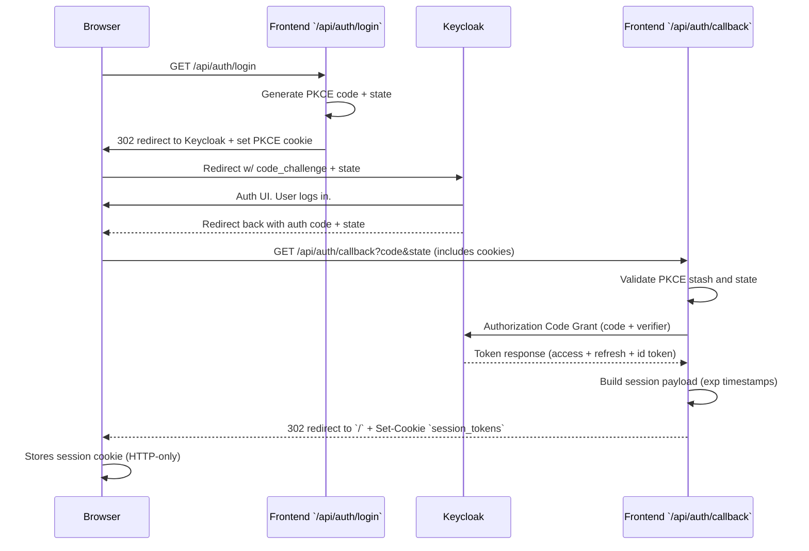
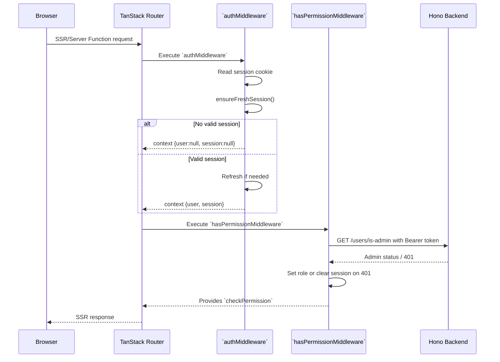
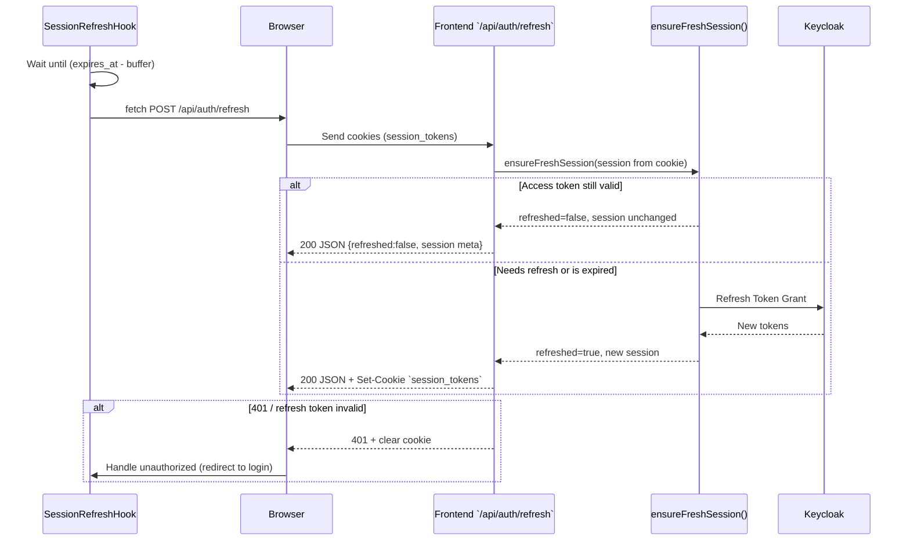
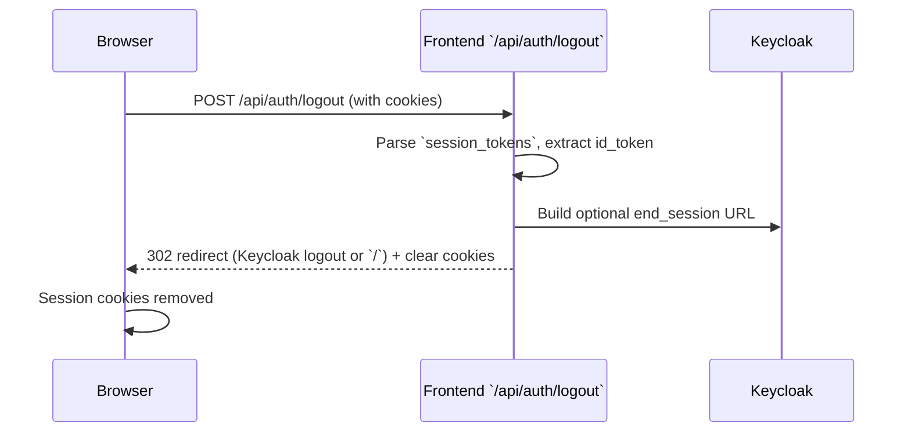

# Authentication Flow

## Login Sequence

```mermaid
sequenceDiagram
    participant Browser
    participant FrontendRoute as Frontend `/api/auth/login`
    participant Keycloak
    participant FrontendCallback as Frontend `/api/auth/callback`

    Browser->>FrontendRoute: GET /api/auth/login
    FrontendRoute->>FrontendRoute: Generate PKCE code + state
    FrontendRoute->>Browser: 302 redirect to Keycloak + set PKCE cookie
    Browser->>Keycloak: Redirect w/ code_challenge + state
    Keycloak->>Browser: Auth UI. User logs in.
    Keycloak-->>Browser: Redirect back with auth code + state
    Browser->>FrontendCallback: GET /api/auth/callback?code&state (includes cookies)
    FrontendCallback->>FrontendCallback: Validate PKCE stash and state
    FrontendCallback->>Keycloak: Authorization Code Grant (code + verifier)
    Keycloak-->>FrontendCallback: Token response (access + refresh + id token)
    FrontendCallback->>FrontendCallback: Build session payload (exp timestamps)
    FrontendCallback-->>Browser: 302 redirect to `/` + Set-Cookie `session_tokens`
    Browser->>Browser: Stores session cookie (HTTP-only)
```

## Request / Middleware Flow

```mermaid
sequenceDiagram
    participant Browser
    participant Router as TanStack Router
    participant AuthMiddleware as `authMiddleware`
    participant PermissionMiddleware as `hasPermissionMiddleware`
    participant Backend as Hono Backend

    Browser->>Router: SSR/Server Function request
    Router->>AuthMiddleware: Execute `authMiddleware`
    AuthMiddleware->>AuthMiddleware: Read session cookie
    AuthMiddleware->>AuthMiddleware: ensureFreshSession()
    alt No valid session
        AuthMiddleware-->>Router: context {user:null, session:null}
    else Valid session
        AuthMiddleware->>AuthMiddleware: Refresh if needed
        AuthMiddleware-->>Router: context {user, session}
    end
    Router->>PermissionMiddleware: Execute `hasPermissionMiddleware`
    PermissionMiddleware->>Backend: GET /users/is-admin with Bearer token
    Backend-->>PermissionMiddleware: Admin status / 401
    PermissionMiddleware->>PermissionMiddleware: Set role or clear session on 401
    PermissionMiddleware-->>Router: Provides `checkPermission`
    Router-->>Browser: SSR response
```

## Token Refresh Sequence

```mermaid
sequenceDiagram
    participant Timer as SessionRefreshHook
    participant Browser
    participant RefreshRoute as Frontend `/api/auth/refresh`
    participant AuthHelpers as ensureFreshSession()
    participant Keycloak

    Timer->>Timer: Wait until (expires_at - buffer)
    Timer->>Browser: fetch POST /api/auth/refresh
    Browser->>RefreshRoute: Send cookies (session_tokens)
    RefreshRoute->>AuthHelpers: ensureFreshSession(session from cookie)
    alt Access token still valid
        AuthHelpers-->>RefreshRoute: refreshed=false, session unchanged
        RefreshRoute-->>Browser: 200 JSON {refreshed:false, session meta}
    else Needs refresh or is expired
        AuthHelpers->>Keycloak: Refresh Token Grant
        Keycloak-->>AuthHelpers: New tokens
        AuthHelpers-->>RefreshRoute: refreshed=true, new session
        RefreshRoute-->>Browser: 200 JSON + Set-Cookie `session_tokens`
    end
    alt 401 / refresh token invalid
        RefreshRoute-->>Browser: 401 + clear cookie
        Browser->>Timer: Handle unauthorized (redirect to login)
    end
```

## Logout Sequence

```mermaid
sequenceDiagram
    participant Browser
    participant LogoutRoute as Frontend `/api/auth/logout`
    participant Keycloak

    Browser->>LogoutRoute: POST /api/auth/logout (with cookies)
    LogoutRoute->>LogoutRoute: Parse `session_tokens`, extract id_token
    LogoutRoute->>Keycloak: Build optional end_session URL
    LogoutRoute-->>Browser: 302 redirect (Keycloak logout or `/`) + clear cookies
    Browser->>Browser: Session cookies removed
```
