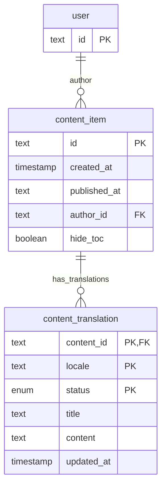

# Content items in CMS

Content items are "orphan pages" - some arbitrary pages left from the legacy Joomla system.

Almost same as the Document, but without versioning system.

Separated from Documents for clarity.

## ERD

