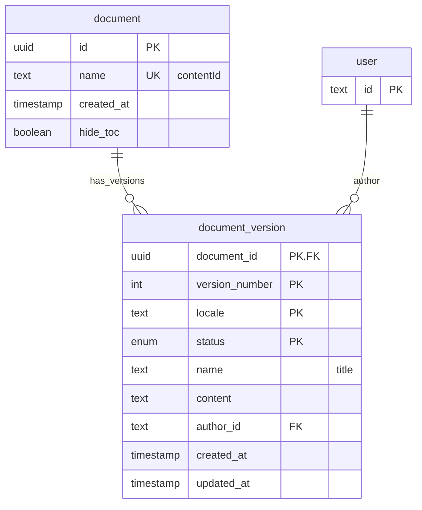

# Documents in CMS

A Document is an entry in CMS db that is a document.

Any Document has:

- `contentId` - the path of the document. If the contentId is "a/b/c", the document can be reached by url `<baseURL>/a/b/c`
- version/revision - documents have versioning. Any document with a given `contentId` would also have path `<contentId>/revision` and `<contentId>/revision/<N>` where N is the number of revision.

**Reserved names**

Admin can create a document with virtually any `contentId`, except:

- those, whose segments contain strings mentioned in [`RESERVED_SEGMENTS`](../src/config/routing-config.ts),
- `contentId` of existing documents or content items

## ERD

