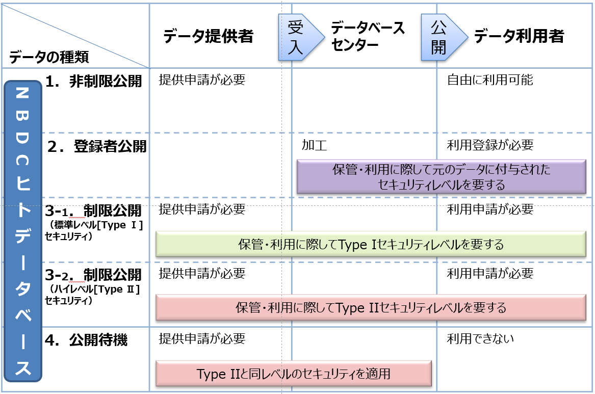




　NBDCヒトデータベースでは、ご提供いただいたデータを広くかつ有効に活用していただくことを推奨しているため、国内の研究機関におけるデータ利用のみならず、学術研究や公衆衛生の向上に資する民間企業や海外の機関における研究へのデータ利用も促進しております。



　「個人情報の保護に関する法律」（平成15 年法律第57 号。）、「行政機関の保有する個人情報の保護に関する法律」（平成15 年法律第58 号。）及び「独立行政法人等の保有する個人情報の保護に関する法律」（平成15 年法律第59 号。）（以下「個人情報保護法」という。）が改正され、2017年5月30日に施行されました。本改正において新たに定義された個人識別符号に該当するゲノムデータを扱う際には、個人情報として取り扱う必要があります。また、個人識別符号に該当するゲノムデータに付随する診断名や検査値等は<u>**要配慮個人情報**</u>にあたりますので、情報の取得の際には原則同意が必要になります。詳細は[FAQ](https://humandbs.dbcls.jp/faq)をご参照ください。


## はじめに

ヒトに関するデータは、次世代シークエンサーをはじめとした解析技術の発達に伴って膨大な量が産生されつつあり、それらを整理・格納して、生命科学の進展や公衆衛生の向上のために有効に活用するためのルールや仕組みが必要である。

[大学共同利用機関法人 情報・システム研究機構（ROIS）](https://www.rois.ac.jp/)、[データサイエンス共同利用基盤施設（DS）](https://ds.rois.ac.jp/)、[ライフサイエンス統合データベースセンター（DBCLS）](https://dbcls.rois.ac.jp/) では、これまで国立研究開発法人科学技術振興機構（JST）NBDC事業推進部が運用してきた、個人情報の保護に配慮しつつ上述の目的でヒトに関する様々なデータの共有や利用を推進するためのプラットフォーム（『NBDCヒトデータベース』）事業の運用主体を引き継ぎ、運用やガイドラインの改定を実施する。

なお、本ガイドラインは、公的資金を用いて産生されたヒトに関するデータ一般に適用することを目的として作成した。ただし、全てのガイドラインとの整合性が確認できているわけではなく、さらには生命科学データに関する世界的な動向、一般社会の科学データに対する考え方も変化していくことが考えられるので、これらに対応していくため、随時必要な修正を加えていくものとする。

### 本ガイドラインに関する連絡先

- データ共有分科会事務局
  [humandbs@dbcls.jp](mailto:humandbs@dbcls.jp)

### 『NBDCヒトデータベース』へのデータ提供やデータ利用等に関する連絡先

- ヒトデータ審査委員会事務局
  [humandbs@dbcls.jp](mailto:humandbs@dbcls.jp)

## １．運用原則

1. 『NBDCヒトデータベース』は以下の原則に基づいて運用される。

   - **原則1** 公的資金により産生されたヒトに関するデータを広く収集すること
   - **原則2** 収集したデータを広く共有できるようにすること
   - **原則3** 研究対象者の権利を可能な限り尊重すること

2. DBCLSは『NBDCヒトデータベース』の運用において以下の項目を実施する。

   1. ガイドラインの整備および必要に応じた見直し
   2. データ提供およびデータ利用申請についての審査
   3. ウェブサイトの整備等データへのアクセス手段の維持

## ２．用語定義

1. **ヒトに関するデータ**
   ヒト由来試料を用いた研究等の成果として産生されたデータ。ゲノム等の遺伝情報や、臨床情報、画像情報等を含む。

2. **公的資金**
   国、地方公共団体、独立行政法人またはこれらに準ずる組織から提供される資金。

3. **研究対象者**
   研究や事業等の活動に自身由来の組織・血液・尿などの試料、もしくは、自身のデータを提供した者。

4. **データ提供者**
   『NBDCヒトデータベース』へヒトに関するデータを提供する研究代表者。

5. **データ利用者**
   『NBDCヒトデータベース』のヒトに関するデータを利用する研究代表者および研究代表者がデータ利用申請時に登録した研究代表者と同一機関に所属する研究分担者。

6. **研究代表者**
   当該研究について責任を負う研究者（所属機関等の倫理審査委員会へ研究内容を申請し、申請内容が承認された研究者、もしくは倫理審査申請書内に名前を連ねる研究分担者）。

7. **非制限公開データ**
   アクセスに制限を設けることなく利用することが可能な公開データ。例えば、すでに発表された論文の集計・統計解析データ等が含まれる。

8. **登録者公開データ**
   制限公開データの利用についてヒトデータ審査委員会による承認を受けたデータ利用期間中の研究者が利用可能なデータ。
   制限公開データとしてNBDCヒトデータベースに登録された各データセットを加工して作成した統計データが含まれる。

9. **制限公開データ**
   データ利用者、利用目的等を明らかにしたうえで、関連研究に従事したことのある研究者が研究のために利用することが可能な公開データ。
   利用の際にはヒトデータ審査委員会の承認が必要。
   例えば、次世代シークエンサーから出力された塩基配列データ、ゲノムワイドな変異データ、画像データ、質問票等の個人毎のデータが含まれる。

10. **公開待機データ**
    論文発表や知的財産権取得等の成果公開の後、非制限公開データあるいは制限公開データとして公開される予定のデータ。

11. **二次データ**
    一次データ（NBDCヒトデータベースを介して共有される制限公開データ）を復元できないよう加工したデータ。

12. **所属機関外利用可能サーバ（『機関外サーバ』）**
    データ利用者が、所属機関が所有するサーバ以外に、制限公開データの保管や計算処理を行うことが可能なサーバであって、
    ヒトに関するデータを解析する環境が整っており、かつ、NBDCヒトデータ取扱いセキュリティガイドラインの遵守を含む覚書をROISあるいはDSと締結した機関が所有する計算機環境であり、ハイレベル【Type II】セキュリティにおいて必要な対策が実施されているサーバ。
    （『機関外サーバ』: [https://humandbs.dbcls.jp/off-premise-server](https://humandbs.dbcls.jp/off-premise-server)）

13. **受託者**
    情報の保管、統計処理その他の研究に関する業務の一部についてのみ、データ利用者からの委託を受けてその監督のもと従事する者。
    海外（日本国外）にある者に委託する場合、利用申請時の研究代表者は研究対象者等の適切な同意を受けるなど、倫理的手続きを実施しなければならない。

## ３．受け入れるデータについて

### 対象データの概要

『NBDCヒトデータベース』には、公的資金を用いたプロジェクト等で産生されたヒトに関するデータを広く受け入れる。
多くの研究者間におけるデータの活用を目的としているため、一部の研究グループやコンソーシアム等の共同研究者間に限定されたデータ共有のためのリポジトリとしての利用を目的としたデータ提供は受け付けない。

当該データの種類は公開の有無、アクセス制限のレベルによって以下の4つに分類される。

1. 非制限公開データ
2. 登録者公開データ
3. 制限公開データ
4. 公開待機データ

『NBDCヒトデータベース』では、

- 1. 非制限公開データ
- 3. 制限公開データ
- 4. 公開待機データ

を受け入れの対象とする。

NBDCヒトデータベースでは、データ提供者が特定の個人（死者を含む）を識別できる記述等の全部または一部を取り除き、代わりに当該個人と関わりのない符号や番号を付し、その後さらに符号・番号の振り直しを施したデータのみを受け入れている。

2. 登録者公開データは、受け入れたデータに対してデータベースセンターがデータ利用促進を目的として実施する加工により作成されたデータである。

## ４．『NBDCヒトデータベース』へのデータの提供について

### ４－１．データ提供者の権利

1. データ提供者は、インフォームドコンセントの説明文書の中で指定している制限項目（研究対象疾患の限定等）に準じて、データ利用時の制限事項を設定することができる。
2. データ提供者は、データを即時公開することが求められるが、論文等による成果公開や知的財産権取得等のために、公開待機データとすることを要求できる。ただし公開待機の期間については合理的に必要な期間に限定し、具体的にはヒトデータ審査委員会と別途協議して決定する。

### ４－２．データ提供者の責務

1. データ提供者は、ヒトに関するデータの由来となる研究対象者に、同意文書・説明文書の必須項目を説明し、データベースへの登録と国内外研究者の共有についての同意を文書で取得し、かつ所属機関の倫理審査委員会の審査・承認と機関の長の許可を得ること。
   （研究全体の当初の倫理審査で許可されている場合は再審査不要。）

2. 説明文書でデータベースへの登録が述べられていない場合など、意図せずに得られたヒトに関するデータを提供するときは、再同意の取得または情報公開・拒否機会の保障を行い、倫理審査委員会の承認と機関の長の許可を得ること。

3. 明らかに「人を対象とする生命科学・医学系研究に関する倫理指針（新指針）」の対象にならないヒト由来試料（例: 学術的価値が定まり広く流通している試料）から得られたデータを提供する場合は、研究代表者の署名済みの「データ提供申請簡易審査希望届（自由書式）」を提出することで、倫理審査関係書類の代わりとすることができる。
   例: [提出例のWordファイル](https://humandbs.dbcls.jp/files/deposit_exemption.docx)

4. インフォームドコンセントに沿った内容であるかについての最終的な責任はデータ提供者が負う。

5. データ提供者は、NBDCヒトデータ提供申請書の記載内容に沿ったデータを提供すること。

6. データ提供者は、提供データから個人を識別できる情報をすべて除去し、符号化・再符号化したデータであることを確認すること。また、同意撤回時に対応できるよう原則として対応表を保管すること。

7. データ提供者は、ヒトデータ審査委員会との協議に基づきデータ区分（非制限公開・制限公開など）を選択し、必要な付随データ（メタデータ、クオリティコントロール情報）を提供する。
   制限公開データについてはセキュリティレベル（Type I / Type II）の分類も行う。

8. 提供データがガイドラインに違反している、あるいは瑕疵のある場合はDBCLSが公開停止・削除を行い、一定期間内に再登録しない場合はアクセッション番号を取り消すことがある。

9. 同意撤回やオプトアウトがあった場合には、以降のデータ利用を防ぐためデータの破棄に協力すること。

10. 提供データに対してDBCLSおよび生命情報・DDBJセンターが行う利便性向上のための加工（統計データ作成・アライメントデータ等）を承諾すること。


データ提供におけるセキュリティレベル（Type I / Type II）については [NBDCヒトデータ取扱いセキュリティガイドライン](https://humandbs.dbcls.jp/guidelines)を参照すること。



#### 同意文書・説明文書の記載内容例について

##### ◆ 同意文書【必須項目】

- データベースへの研究データの登録および国内外の多くの研究者間におけるデータ共有について

##### ◆ 説明文書【必須項目】

- データベースへの研究データの登録および国内外の多くの研究者間における共有について
  _具体例_:
  「本研究で得られたデータは、公衆衛生の向上に貢献する他の研究でも重要なため、公的データベースに登録し国内外の多くの研究者と共有します。」

- 外国にある第三者による利用について
  _具体例_:
  「どの国の研究者が利用するかは現時点では不明ですが、日本国内の法令やガイドラインに準じた利用が求められます。」

##### ◆ 説明文書【含まれることが望ましい項目】

- **DBCLSについて**
  _具体例_:
  DBCLSは公的なデータベースを運用し、個人情報の保護に配慮しつつヒトに関するデータを共有し、迅速な研究推進に寄与している。

- **データ共有の必要性・重要性**
  _具体例_:
  「研究結果が国内外で利用されることで研究が推進され、新規技術開発や疾患の原因解明に貢献します。」

- **公開されるデータについて**
  _具体例_:
  「公開時にはアクセスレベルが異なります。頻度情報・統計情報は非制限公開、個人単位のデータは制限公開として審査後に利用されます。」

- **撤回が不可能なデータについて**
  _具体例_:
  「論文発表後は同意撤回ができません。データベースからも個人特定が不可能であれば破棄できない場合があります。」

### ４－３．提供の手順

1. 「４－２ データ提供者の責務」に示した条件を満たしていることを確認する。
2. データ区分（非制限・制限・公開待機）についてヒトデータ審査委員会事務局と調整する。
3. [データ提供申請の手順](https://humandbs.dbcls.jp/data-submission) に沿って申請を行う。
   研究計画書の写し、承認通知書の写し、インフォームドコンセントの文書フォームを添付する。
   （研究全体で既に許可されている場合は承認通知書写しで代用可。）

4. ヒトデータ審査委員会がデータ受入れ可否を審査する。
5. 承認後にデータセット（非制限公開・制限公開）を作成する。
6. DBCLSの指示に従ってデータおよび付随データを送付する。
7. アップデートや分類見直し等が必要な場合は、ヒトデータ審査委員会事務局と協議し対応する。

## ５．『NBDCヒトデータベース』からのデータの利用について

### ５－１．利用資格

#### ５－１－１　非制限公開データ

- 誰でも利用可能。

#### ５－１－２　登録者公開データ

- ヒトデータ審査委員会の承認を受けた研究者が利用可能。
  登録には所属機関が発行するメールアドレスを提示すること。

  - 研究に従事したことのある研究者（大学、公的研究機関、民間企業などに所属し、関連研究歴がある人）。
    学術研究または公衆衛生向上に資する研究に限る。

#### ５－１－３　制限公開データ

- データセットに付加された制限事項に示される要件を満たす研究者が利用申請できる。
  申請時には所属機関のメールアドレスを提示すること。

  - 関連研究に従事した研究者（大学、公的研究機関、民間企業などに所属し、関連研究歴がある人）。
    学術研究または公衆衛生向上に資する研究に限る。
    申請時に関係する研究についての論文などを提示すること。

---

### ５－２．データ利用者の権利

#### ５－２－１　非制限公開データ

1. データ利用者は、責務および制限事項を守る限り、利用した研究成果を自由に発表できる。
2. データ利用者は、同様に知的財産権を自由に取得できる。

#### ５－２－２　登録者公開データ

1. 登録が完了した者は、登録者公開データを閲覧できる。

#### ５－２－３　制限公開データ

1. データ利用者は、責務および制限事項を守る限り、利用した研究成果を自由に発表できる。
2. 同様に知的財産権を自由に取得できる。
3. 所属組織LANの他、『機関外サーバ』の指定領域にデータをダウンロードして保管・利用できる。
4. DBCLSおよびDDBJセンターが加工したデータ（アライメントデータ・バリアントコールデータ・統計データなど）を利用できる。

---

### ５－３．データ利用者の責務

#### ５－３－１　非制限公開データ

1. データの品質・科学的妥当性について、利用者の責任で活用すること。
2. NBDCヒトデータベースから取得したデータおよび加工データについて、下記を遵守すること。

   
   **データの利用にあたって遵守すべき基本的事項**

   - 研究・開発利用に限定
   - 武器開発・軍事への利用禁止
   - 個人同定の禁止
   - 最新データのダウンロードおよび使用

   

3. データを論文等で公表する場合はアクセッション番号を記載し、以下のような謝辞を付けること。

   

   **謝辞の例**
   「本研究に使用したデータ（の一部）はAAAAプロジェクト/研究グループ（代表者 BBBB）によって取得され、
   情報・システム研究機構データサイエンス共同利用基盤施設ライフサイエンス統合データベースセンター（DBCLS）の
   『NBDCヒトデータベース』ウェブサイトを通じて提供されたものです。」

   **英文例**
   (A part of) The data used for this research was originally obtained by AAAA research project/group led by Prof./Dr. BBBB and available at the website of the NBDC Human Database website of the Database Center for Life Science (DBCLS) / the Joint Support-Center for Data Science Research of the Research Organization of Information and Systems.

   

#### ５－３－２　登録者公開データ

1. データの品質・科学的妥当性について、利用者の責任で活用すること。
2. 元データを利用する研究を行う場合は別途利用申請し、審査委員会の承認を受けること。
3. 登録した本人以外がデータを閲覧しないよう管理すること。
4. 論文等で引用する場合はアクセッション番号を記載すること。

---

#### ５－３－３　制限公開データ

1. データの品質・科学的妥当性について、利用者の責任で活用すること。
2. データの管理・利用については利用者の全責任で行うこと（第三者に対する責任含む）。
   管理に問題が発生した場合には所属機関の長にも責任が及ぶことを了承する。
3. 生命科学・医学系研究に関する倫理指針を遵守し、研究計画書・倫理審査の承認・所属機関の許可を得ること。
4. データの利用にあたり、次を遵守すること。

   

   **データの利用にあたって遵守すべき基本的事項**

   - 研究代表者およびその同一機関の研究分担者・受託者に限定
   - 利用目的の明示
   - 申請外の目的での使用禁止
   - 研究・開発利用に限定
   - 武器開発・軍事への利用禁止
   - 個人同定の禁止
   - 再配布の禁止
     （ただし個人識別性・一次データ復元性のないデータは条件付きで再配布可。原則、別途申請が必要。）
     詳細: [FAQ](https://humandbs.dbcls.jp/faq#faq-21)

   

5. セキュリティガイドライン（データ利用者向け）を遵守すること。
   サーバ監査にも応じる義務がある。

   
   **セキュリティレベルについて**

   原則 Type I だが、協議により Type II が必要となる場合がある。
   詳細は「NBDCヒトデータ取扱いセキュリティガイドライン（データ利用者向け）」参照。
   

6. セキュリティレベルに応じた管理体制を構築し、チェックリストを提出すること。
   受託者が利用する場合も同様。

7. 『機関外サーバ』を利用する場合は、当該サーバの利用規約も遵守すること。

8. 万が一漏えいなどの事故が起こった場合は、すぐにネットワークから切り離し、DBCLSに通報し、その後の指示に従うこと。

9. 同意撤回やオプトアウトがあったデータについては、それ以降利用を停止すること。

10. データ利用終了時にはすべてのデータおよび復元可能な関連データを削除し、利用終了申請を通じて報告すること。
    二次データ保管や配布を希望する場合は申請が必要。

11. 論文等で発表する場合はアクセッション番号を記載し、謝辞を明記すること。
    （JGA利用の場合は推奨論文: [Nucleic Acids Res. 2015, 43 Database issue: D18-D22](http://nar.oxfordjournals.org/content/43/D1/D18)）

12. 利用状況の公開において、DBCLSが個別情報・統計情報を公表することを了承すること。

13. 申請・利用終了時の情報、事故時の情報などをDBCLSが保管することを了承すること。


研究代表者だけでなく研究分担者や受託者も本ガイドラインに準拠する必要があり、研究代表者はその責任を持つ。


### ５－４．利用の手順

#### ５－４－１　非制限公開データ

- ウェブサイト [https://humandbs.dbcls.jp/](https://humandbs.dbcls.jp/) から法令の範囲内で自由に利用可能。

#### ５－４－２　登録者公開データ

1. ヒトデータ審査委員会の承認を得た研究者がDBCLSに登録する。
2. データへのアクセスに必要な情報が提供される。

#### ５－４－３　制限公開データ

1. [データ利用申請の手順](https://humandbs.dbcls.jp/data-use) に沿って申請する。
   共同研究者が別組織にいる場合は、それぞれの組織ごとに申請が必要。受託者も含める。
2. 倫理審査・機関長の許可の写しを提出する。
   免除される場合はその旨を証明する書類を提出する。
3. チェックリストや必要書類を提出する。
4. ヒトデータ審査委員会が審査する。
5. 承認後にデータへのアクセス権が付与される。
6. 年1回、データ利用報告申請を行い、再度チェックリストを提出する。
7. 加工データを配布したい場合は申請書の中で申請する。
8. 利用延長したい場合は1か月前までに再申請する。
9. 利用終了時にはすべてのデータを削除し、利用終了申請で報告する。
   二次データを保管・配布したい場合は申請内容を記載し、承認を得る。

### ５－５．利用に関する費用

- データ転送用のメディアや『機関外サーバ』利用などの実費はデータ利用者負担。

### ５－６．利用の停止

1. データ利用者に違反が疑われる場合、DBCLSが調査を行い、必要に応じてヒトデータ審査委員会が利用停止などの判断を行う。

   - データ利用停止の命令
   - 新規申請の受け付け停止
   - 所属機関長への報告
     状況により疑いの段階で停止命令が出ることがある。停止連絡を受け次第、すべてのデータを消去し、破棄状況を報告する。

2. データ提供者の責務違反により公開停止となった場合も、データ利用者に停止を求めることがある。
   その際の損害についてDBCLSは一切責任を負わない。

## ６．本ガイドラインの改訂手続きについて

### ６－１．改訂内容の提案

データ提供者、データ利用者あるいはデータの利用を検討している者は本ガイドラインを改訂することによって、ヒトに関するデータがより円滑に提供・利用できると考えられる点があれば、事務局へ提案することができる。その際、具体的な提案や該当箇所等を示すこと。

### ６－２．改訂内容の検討

上記の提案を受けた場合、速やかにその内容をデータ共有分科会で検討し、提案内容の採否あるいは修正について決定するものとする。

### ６－３．改訂内容の公表・適用

改訂内容が決定した場合、速やかにその改訂内容をウェブサイトにおいて告知し、データ共有分科会が定める一定の期間ののち適用する。なお、適用前にデータ提供あるいはデータ利用の申請を行って許可された者に対しても、改訂後のガイドラインが適用されるものとする。

## ７．その他

### ７－１．データ提供申請情報およびデータ利用申請情報の公開について

『NBDCヒトデータベース』に対する個別の申請情報のうち、申請者の承諾が得られた情報は公開されるものとする。その他の情報に関しては、ヒトデータ審査委員会委員およびヒトデータ審査委員会事務局員はこれを関係者以外に公開してはならない。

### ７－２．不正確なデータ等の指摘について

『NBDCヒトデータベース』における不正確なデータについてのデータ利用者からの指摘は、ヒトデータ審査委員会が受付けて、データ提供者に通知し、対応を協議するものとする。同意取得方法の不備や同意の捏造の可能性等に関する同意者等からの指摘についても同様とする。
連絡先： ヒトデータ審査委員会事務局　humandbs@dbcls.jp

### ７－３．ねつ造や改ざん等による研究不正に関する調査について

1. 『NBDCヒトデータベース』に格納されているデータについて、DBCLSに研究不正に関する調査への協力依頼があった際には、DBCLSは協力することがある。
2. 不正調査委員会等の責任者は、検証を実施するために必要なデータのDataset IDと検証の必要性についてDBCLSへ申し出ると共に、データを保管するサーバのセキュリティ状況を「NBDCヒトデータ取扱いセキュリティガイドラインチェックリスト」を用いて報告すること。
3. 不正調査委員会等の責任者の全責任のもとでデータを使用すること。
4. 不正調査委員会等の責任者は、５－３．データ利用者の責務５－３－３．制限公開データ４．『データの利用にあたって遵守すべき基本的事項』を遵守すること。

## 参照

[NBDCヒトデータ取扱いセキュリティガイドライン](https://humandbs.dbcls.jp/guidelines)

以上
